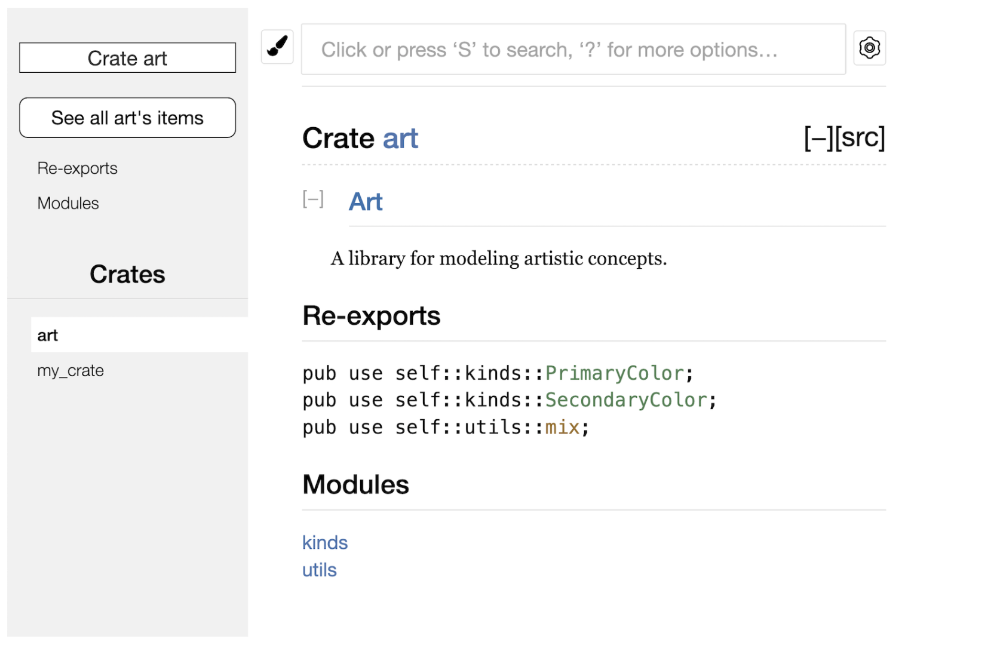

# More About Cargo and Crates.io

So far we’ve used only the most basic features of `Cargo` to build, run, and test our code, but it can do a lot more. In this chapter, we’ll discuss some of its other, more advanced features to show you how to do the following:

- Customize your build through release profiles
- Publish libraries on crates.io
- Organize large projects with workspaces
- Install binaries from crates.io
- Extend Cargo using custom commands

## Customizing Builds with Release Profiles

## Customizing Builds with Release Profiles

In Rust, release profiles are predefined and customizable profiles with different configurations that allow a programmer to have more control over various options for compiling code. Each profile is configured independently of the others.

Cargo has two main profiles: the `dev` profile Cargo uses when you run `cargo build` and the `release` profile Cargo uses when you run `cargo build --release`. The `dev` profile is defined with good defaults for development, and the `release` profile has good defaults for release builds.

These profile names might be familiar from the output of your builds:

```bash
$ cargo build
Finished dev [unoptimized + debuginfo] target(s) in 0.0s
$ cargo build --release
Finished release [optimized] target(s) in 0.0s
```

The `dev` and `release` are these different profiles used by the compiler.

Cargo has default settings for each of the profiles that apply when you haven't explicitly added any [profile.*] sections in the project’s Cargo.toml file. By adding [profile.*] sections for any profile you want to customize, you override any subset of the default settings. For example, here are the default values for the opt-level setting for the dev and release profiles:


```
[profile.dev]
opt-level = 0

[profile.release]
opt-level = 3
```

**The `opt-level` setting controls the number of optimizations Rust will apply to your code, with a range of 0 to 3. Applying more optimizations extends compiling time, so if you’re in development and compiling your code often, you’ll want fewer optimizations to compile faster even if the resulting code runs slower. The default opt-level for dev is therefore 0. When you’re ready to release your code, it’s best to spend more time compiling. You’ll only compile in release mode once, but you’ll run the compiled program many times, so release mode trades longer compile time for code that runs faster.** That is why the default opt-level for the release profile is 3.

## Publishing a Crate to Crates.io

We’ve used packages from crates.io as dependencies of our project, but you can also share your code with other people by publishing your own packages. The crate registry at crates.io distributes the source code of your packages, so it primarily hosts code that is open source.

Rust and Cargo have features that make your published package easier for people to find and use. We’ll talk about some of these features next and then explain how to publish a package.

### Making Useful Documentation Comments

Accurately documenting your packages will help other users know how and when to use them, so it’s worth investing the time to write documentation. In Chapter 3, we discussed how to comment Rust code using two slashes, //. Rust also has a particular kind of comment for documentation, known conveniently as a **documentation comment**, that will generate HTML documentation. The HTML displays the contents of documentation comments for public API items intended for programmers interested in knowing how to use your crate as opposed to how your crate is implemented.

Documentation comments use **three** slashes, `///`, instead of two and support Markdown notation for formatting the text. Place documentation comments just before the item they’re documenting. Listing 14-1 shows documentation comments for an add_one function in a crate named my_crate.


```rust

/// Adds one to the number given.
///
/// # Examples
///
/// ```
/// let arg = 5;
/// let answer = my_crate::add_one(arg);
///
/// assert_eq!(6, answer);
/// ```
pub fn add_one(x: i32) -> i32 {
    x + 1
}
// Listing 14-1: A documentation comment for a function
```

Here, we give a description of what the `add_one` function does, start a section with the heading Examples, and then provide code that demonstrates how to use the add_one function. We can generate the HTML documentation from this documentation comment by running `cargo doc`. This command runs the `rustdoc` tool distributed with Rust and puts the generated HTML documentation in the `target/doc` directory.

For convenience, running cargo doc --open will build the HTML for your current crate’s documentation (as well as the documentation for all of your crate’s dependencies) and open the result in a web browser. Navigate to the add_one function and you’ll see how the text in the documentation comments is rendered, as shown in Figure 14-1:

## Commonly used Sections

We used the `# Examples` Markdown heading in Listing 14-1 to create a section in the HTML with the title `“Examples.”` Here are some other sections that crate authors commonly use in their documentation:

`Panics`: The scenarios in which the function being documented could panic. Callers of the function who don’t want their programs to panic should make sure they don’t call the function in these situations.
`Errors`: If the function returns a Result, describing the kinds of errors that might occur and what conditions might cause those errors to be returned can be helpful to callers so they can write code to handle the different kinds of errors in different ways.
`Safety`: If the function is unsafe to call (we discuss unsafety in Chapter 19), there should be a section explaining why the function is unsafe and covering the invariants that the function expects callers to uphold.

Most documentation comments don’t need all of these sections, but this is a good checklist to remind you of the aspects of your code users will be interested in knowing about.

## Documentation Comments as Tests

Adding example code blocks in your documentation comments can help demonstrate how to use your library, and doing so has an additional bonus: running `cargo test` will run the code examples in your documentation as tests! Nothing is better than documentation with examples. But nothing is worse than examples that don’t work because the code has changed since the documentation was written. If we run `cargo test` with the documentation for the `add_one` function from Listing 14-1, we will see a section in the test results like this:

```bash
   Doc-tests my_crate

running 1 test
test src/lib.rs - add_one (line 5) ... ok

test result: ok. 1 passed; 0 failed; 0 ignored; 0 measured; 0 filtered out; finished in 0.27s
```

### Commenting Contained Items

The style of doc comment //! adds documentation to the item that contains the comments rather than to the items following the comments. We typically use these doc comments inside the crate root file (src/lib.rs by convention) or inside a module to document the crate or the module as a whole.

For example, to add documentation that describes the purpose of the my_crate crate that contains the add_one function, we add documentation comments that start with //! to the beginning of the src/lib.rs file, as shown in Listing 14-2:

```rust
//! # My Crate
//!
//! `my_crate` is a collection of utilities to make performing certain
//! calculations more convenient.

/// Adds one to the number given.
// --snip--
Listing 14-2: Documentation for the my_crate crate as a whole
```


Notice there isn’t any code after the last line that begins with //!. Because we started the comments with `//!` instead of `///`, we’re documenting the item that **contains** this comment rather than an item that follows this comment. In this case, that item is the src/lib.rs file, which is the crate root. **These comments describe the entire crate.**

When we run **cargo doc --open, these comments will display on the front page of the documentation for my_crate above the list of public items in the crate**.

Documentation comments within items are useful for describing crates and modules especially. Use them to explain the overall purpose of the container to help your users understand the crate’s organization.

### Exporting a Convenient Public API with pub use

The structure of your public API is a major consideration when publishing a crate. People who use your crate are less familiar with the structure than you are and might have difficulty finding the pieces they want to use if your crate has a large module hierarchy.

In Chapter 7, we covered how to make items public using the `pub` keyword, and bring items into a scope with the `use` keyword. However, the structure that makes sense to you while you’re developing a crate might not be very convenient for your users. You might want to organize your structs in a hierarchy containing multiple levels, but then people who want to use a type you’ve defined deep in the hierarchy might have trouble finding out that type exists. They might also be annoyed at having to enter use `my_crate::some_module::another_module::UsefulType;` rather than use `my_crate::UsefulType;`.

The good news is that if the structure isn’t convenient for others to use from another library, you don’t have to rearrange your internal organization: instead, you can re-export items to make a public structure that’s different from your private structure by using pub use. Re-exporting takes a public item in one location and makes it public in another location, as if it were defined in the other location instead.

The good news is that if the structure isn’t convenient for others to use from another library, you don’t have to rearrange your internal organization: instead, you can re-export items to make a public structure that’s different from your private structure by using pub use. Re-exporting takes a public item in one location and makes it public in another location, as if it were defined in the other location instead. Ah so maybe in the API file or top-level file, you'll see a bunch of `pub use` everywhere.

For example, say we made a library named art for modeling artistic concepts. Within this library are two modules: a kinds module containing two enums named PrimaryColor and SecondaryColor and a utils module containing a function named mix, as shown in Listing 14-3:

Filename: src/lib.rs

```rust
//! # Art
//!
//! A library for modeling artistic concepts.

pub mod kinds {
/// The primary colors according to the RYB color model.
    pub enum PrimaryColor {
        Red,
        Yellow,
        Blue,
    }

    /// The secondary colors according to the RYB color model.
    pub enum SecondaryColor {
        Orange,
        Green,
        Purple,
    }
}

pub mod utils {
    use crate::kinds::*;

    /// Combines two primary colors in equal amounts to create
    /// a secondary color.
    pub fn mix(c1: PrimaryColor, c2: PrimaryColor) -> SecondaryColor {
        // --snip--
    }
}
```

Note that the `PrimaryColor` and `SecondaryColor` types aren’t listed on the front page, nor is the mix function. We have to click `kinds` and `utils` to see them.

Another crate that depends on this library would need `use` statements that bring the items from art into scope, specifying the module structure that’s currently defined. Listing 14-4 shows an example of a crate that uses the `PrimaryColor` and mix items from the art crate:

Filename: src/main.rs
```rust
use art::kinds::PrimaryColor;
use art::utils::mix;

fn main() {
    let red = PrimaryColor::Red;
    let yellow = PrimaryColor::Yellow;
    mix(red, yellow);
}
```
**The author of the code in Listing 14-4, which uses the art crate, had to figure out that PrimaryColor is in the kinds module and mix is in the utils module**. The module structure of the art crate is more relevant to developers working on the art crate than to those using it. The internal structure doesn’t contain any useful information for someone trying to understand how to use the art crate, but rather causes confusion because developers who use it have to figure out where to look, and must specify the module names in the use statements.

To remove the internal organization from the public API, we can modify the art crate code in Listing 14-3 to add `pub use` statements to `re-export` the items at the top level, as shown in Listing 14-5:

Filename: src/lib.rs

```rust
//! # Art
//!
//! A library for modeling artistic concepts.

pub use self::kinds::PrimaryColor;
pub use self::kinds::SecondaryColor;
pub use self::utils::mix;

pub mod kinds {
// --snip--
}

pub mod utils {
// --snip--
}
// Listing 14-5: Adding pub use statements to re-export items
```

The API documentation that `cargo doc` generates for this crate will now list and link re-exports on the front page, as shown in Figure 14-4, making the `PrimaryColor` and `SecondaryColor` types and the mix function easier to find.



The art crate users can still see and use the internal structure from Listing 14-3 as demonstrated in Listing 14-4, OR (even better) they can use the more convenient structure in Listing 14-5, as shown in Listing 14-6:

Filename: src/main.rs

```rust
use art::mix;
use art::PrimaryColor;

fn main() {
// --snip--
}
```

In cases where there are many nested modules, re-exporting the types at the top level with `pub use` can make a significant difference in the experience of people who use the crate. Another common use of `pub use` is to re-export definitions of a dependency in the current crate to make that crate's definitions part of your crate’s public API.

Creating a useful public API structure is more of an art than a science, and you can iterate to find the API that works best for your users. Choosing `pub use` gives you flexibility in how you structure your crate internally and **decouples that internal structure from what you present to your users**. Look at some of the code of crates you’ve installed to see if their internal structure differs from their public API.

### Setting up a crates.io account

Before you can publish any crates, you need to create an account on crates.io and get an API token. To do so, visit the home page at `crates.io` and log in via a GitHub account. (The GitHub account is currently a requirement, but the site might support other ways of creating an account in the future.) Once you’re logged in, visit your account settings at `https://crates.io/me/` and retrieve your API key. Then run the `cargo login` command with your API key, like this:

```bash
$ cargo login abcdefghijklmnopqrstuvwxyz012345
```

This command will inform Cargo of your API token and store it locally in `~/.cargo/credentials`. Note that this token is a secret: do not share it with anyone else. If you do share it with anyone for any reason, you should revoke it and generate a new token on crates.io.

### Adding metadata to the Crate

Let’s say you have a crate you want to publish. Before publishing, you’ll need to add some metadata in the [package] section of the crate’s Cargo.toml file.

Your crate will need a unique name. While you’re working on a crate locally, you can name a crate whatever you’d like. However, crate names on crates.io are allocated on a first-come, first-served basis. Once a crate name is taken, no one else can publish a crate with that name. Before attempting to publish a crate, search for the name you want to use. If the name has been used, you will need to find another name and edit the name field in the Cargo.toml file under the [package] section to use the new name for publishing, like so:

Filename: Cargo.toml

```bash
[package]
name = "guessing_game"
```

### Publishing to crates.io

Now that you’ve created an account, saved your API token, chosen a name for your crate, and specified the required metadata, you’re ready to publish! Publishing a crate uploads a specific version to crates.io for others to use.

Be careful, **because a publish is permanent. The version can never be overwritten, and the code cannot be deleted.** One major goal of crates.io is to act as a permanent archive of code so that builds of all projects that depend on crates from crates.io will continue to work. Allowing version deletions would make fulfilling that goal impossible. However, there is no limit to the number of crate versions you can publish.

Run the cargo publish command again. It should succeed now:

```bash
$ cargo publish
Updating crates.io index
Packaging guessing_game v0.1.0 (file:///projects/guessing_game)
Verifying guessing_game v0.1.0 (file:///projects/guessing_game)
Compiling guessing_game v0.1.0
(file:///projects/guessing_game/target/package/guessing_game-0.1.0)
Finished dev [unoptimized + debuginfo] target(s) in 0.19s
Uploading guessing_game v0.1.0 (file:///projects/guessing_game)
```
Congratulations! You’ve now shared your code with the Rust community, and anyone can easily add your crate as a dependency of their project.

## Cargo Workspaces

In Chapter 12, we built a package that included a binary crate and a library crate. As your project develops, you might find that the library crate continues to get bigger and you want to split your package further into multiple library crates. Cargo offers a feature called `workspaces` that can help manage multiple related packages that are developed in tandem.

### Creating a workspace

**A workspace is a set of packages that share the same `Cargo.lock` and output directory**. Let’s make a project using a workspace — we’ll use trivial code so we can concentrate on the structure of the workspace. There are multiple ways to structure a workspace, so we'll just show one common way. We’ll have a workspace containing a binary and two libraries. The binary, which will provide the main functionality, will depend on the two libraries. One library will provide an add_one function, and a second library an add_two function. These three crates will be part of the same workspace. We’ll start by creating a new directory for the workspace:


## Topics

- cargo doc
- rustdoc
- cargo doc --open
- crates vs modules vs workspaces
- cargo test -p add_one to run a specific crate
- cargo --list

