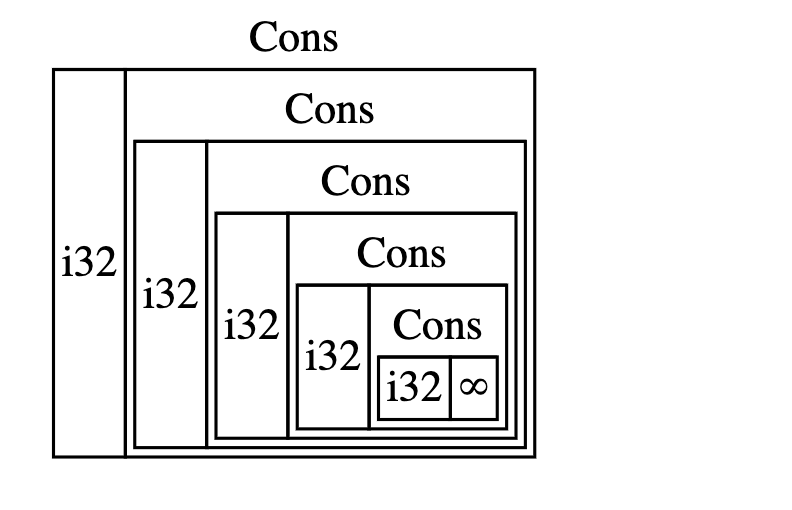

# Smart Pointers
**A pointer is a general concept for a variable that contains an address in memory. This address refers to, or “points at,” some other data. The most common kind of pointer in Rust is a reference, which you learned about in Chapter 4. References are indicated by the & symbol and borrow the value they point to.** They don’t have any special capabilities other than referring to data, and have no overhead.

**Smart pointers, on the other hand, are data structures that act like a pointer but also have additional metadata and capabilities. The concept of smart pointers isn’t unique to Rust: smart pointers originated in C++ and exist in other languages as well.** Rust has a variety of smart pointers defined in the standard library that provide functionality beyond that provided by references. To explore the general concept, we’ll look at a couple of different examples of smart pointers, including a reference counting smart pointer type. This pointer enables you to allow data to have multiple owners by keeping track of the number of owners and, when no owners remain, cleaning up the data.

Rust, with its concept of ownership and borrowing, has an additional difference between references and smart pointers: **while references only borrow data, in many cases, smart pointers own the data they point to.**

Though we didn’t call them as such at the time, we’ve already encountered a few smart pointers in this book, including String and Vec<T> in Chapter 8. Both these types count as smart pointers because they own some memory and allow you to manipulate it. They also have metadata and extra capabilities or guarantees. String, for example, stores its capacity as metadata and has the extra ability to ensure its data will always be valid UTF-8.

**Smart pointers are usually implemented using structs.** Unlike an ordinary struct, smart pointers implement the `Deref` and `Drop` traits. The Deref trait allows an instance of the smart pointer struct to behave like a reference so you can write your code to work with either references or smart pointers. The Drop trait allows you to customize the code that’s run when an instance of the smart pointer goes out of scope. In this chapter, we’ll discuss both traits and demonstrate why they’re important to smart pointers.

Given that the smart pointer pattern is a general design pattern used frequently in Rust, this chapter won’t cover every existing smart pointer. Many libraries have their own smart pointers, and you can even write your own. We’ll cover the most common smart pointers in the standard library:

- `Box<T>` for allocating values on the heap
- `Rc<T>`, a reference counting type that enables multiple ownership
- `Ref<T>` and `RefMut<T>`, accessed through `RefCell<T>`, a type that enforces the borrowing rules at runtime instead of compile time

In addition, we’ll cover the interior mutability pattern where an immutable type exposes an API for mutating an interior value. We’ll also discuss reference cycles: how they can leak memory and how to prevent them.

## Using Box<T> to Point to data on the Heap

The most straightforward smart pointer is a box, whose type is written `Box<T>`. **Boxes allow you to store data on the heap rather than the stack. What remains on the stack is the pointer to the heap data.**

Boxes don’t have performance overhead, other than storing their data on the heap instead of on the stack. But they don’t have many extra capabilities either. You’ll use them most often in these situations:

- When you have a type whose size can’t be known at compile time and you want to use a value of that type in a context that requires an exact size
- When you have a large amount of data and you want to transfer ownership but ensure the data won’t be copied when you do so
- When you want to own a value and you care only that it’s a type that implements a particular trait rather than being of a specific type
- 
We’ll demonstrate the first situation in the “Enabling Recursive Types with Boxes” section. In the second case, transferring ownership of a large amount of data can take a long time because the data is copied around on the stack. To improve performance in this situation, we can store the large amount of data on the heap in a box. Then, only the small amount of pointer data is copied around on the stack, while the data it references stays in one place on the heap. The third case is known as a trait object, and Chapter 17 devotes an entire section, “Using Trait Objects That Allow for Values of Different Types,” just to that topic. So what you learn here you’ll apply again in Chapter 17!

### Using a Box<T> to Store Data on the Heap
Before we discuss the heap storage use case for `Box<T>`, we’ll cover the syntax and how to interact with values stored within a `Box<T>`.

Listing 15-1 shows how to use a box to store an `i32` value on the heap:

Filename: src/main.rs

```rust
fn main() {
    let b = Box::new(5);
    println!("b = {}", b);
}
```

We define the variable b to have the value of a Box that points to the value 5, which is allocated on the heap. This program will print b = 5; in this case, we can access the data in the box similar to how we would if this data were on the stack. Just like any owned value, when a box goes out of scope, as b does at the end of main, it will be deallocated. The deallocation happens both for the box (stored on the stack) and the data it points to (stored on the heap).

Putting a single value on the heap isn’t very useful, so you won’t use boxes by themselves in this way very often. **Having values like a single i32 on the stack, where they’re stored by default, is more appropriate in the majority of situations.** Let’s look at a case where boxes allow us to define types that we wouldn’t be allowed to if we didn’t have boxes.

### Enabling Recursive Types with Boxes

A value of recursive type can have another value of the same type as part of itself. **Recursive types pose an issue because at compile time Rust needs to know how much space a type takes up**. However, the nesting of values of recursive types could theoretically continue infinitely, so Rust can’t know how much space the value needs. Because boxes have a known size, we can enable recursive types by inserting a box in the recursive type definition.

As an example of a recursive type, let’s explore the cons list. This is a data type commonly found in functional programming languages. The cons list type we’ll define is straightforward except for the recursion; therefore, the concepts in the example we’ll work with will be useful any time you get into more complex situations involving recursive types.

### More Information About the Cons List
**A cons list is a data structure that comes from the Lisp programming language and its dialects and is made up of nested pairs, and is the Lisp version of a linked list**. Its name comes from the cons function (short for `“construct function”`) in Lisp that constructs a new pair from its two arguments. By **calling cons on a pair consisting of a value and another pair**, we can construct cons lists made up of recursive pairs.

For example, here’s a pseudocode representation of a cons list containing the list 1, 2, 3 with each pair in parentheses:

```rust
(1, (2, (3, Nil)))
```

Each item in a cons list contains two elements: the value of the current item and the next item. The last item in the list contains only a value called Nil without a next item. A cons list is produced by recursively calling the cons function. The canonical name to denote the base case of the recursion is Nil. Note that this is not the same as the “null” or “nil” concept in Chapter 6, which is an invalid or absent value.

The cons list isn’t a commonly used data structure in Rust. Most of the time when you have a list of items in Rust, Vec<T> is a better choice to use. Other, more complex recursive data types are useful in various situations, but by starting with the cons list in this chapter, we can explore how boxes let us define a recursive data type without much distraction.

Listing 15-2 contains an enum definition for a cons list. Note that this code won’t compile yet because the List type doesn’t have a known size, which we’ll demonstrate.

```rust
// This code does not compile!
enum List {
    Cons(i32, List),
    Nil,
}
// Listing 15-2: The first attempt at defining an enum to represent a cons list data structure of i32 values
```

> Note: We’re implementing a cons list that holds only i32 values for the purposes of this example. We could have implemented it using generics, as we discussed in Chapter 10, to define a cons list type that could store values of any type.

Using the List type to store the list 1, 2, 3 would look like the code in Listing 15-3:

Filename: src/main.rs
```rust
use crate::List::{Cons, Nil};

fn main() {
    let list = Cons(1, Cons(2, Cons(3, Nil)));
}
// Listing 15-3: Using the List enum to store the list 1, 2, 3
```

The first Cons value holds 1 and another List value. This List value is another Cons value that holds 2 and another List value. This List value is one more Cons value that holds 3 and a List value, which is finally Nil, the non-recursive variant that signals the end of the list.

```bash
cargo run
Compiling cons-list v0.1.0 (file:///projects/cons-list)
error[E0072]: recursive type `List` has infinite size
--> src/main.rs:1:1
|
1 | enum List {
| ^^^^^^^^^
2 |     Cons(i32, List),
|               ---- recursive without indirection
|
help: insert some indirection (e.g., a `Box`, `Rc`, or `&`) to break the cycle
|
2 |     Cons(i32, Box<List>),
|               ++++    +
```
For more information about this error, try `rustc --explain E0072`.
error: could not compile `cons-list` (bin "cons-list") due to 1 previous error
Listing 15-4: The error we get when attempting to define a recursive enum

The error shows this type “has infinite size.” The reason is that we’ve defined List with a variant that is recursive: it holds another value of itself directly. As a result, Rust can’t figure out how much space it needs to store a List value. Let’s break down why we get this error. First, we’ll look at how Rust decides how much space it needs to store a value of a non-recursive type.

### Computing the Size of a Non-Recursive Type
Recall the Message enum we defined in Listing 6-2 when we discussed enum definitions in Chapter 6:
```rust
enum Message {
    Quit,
    Move { x: i32, y: i32 },
    Write(String),
    ChangeColor(i32, i32, i32),
}
```

To determine how much space to allocate for a Message value, Rust goes through each of the variants to see which variant needs the most space. Rust sees that Message::Quit doesn’t need any space, Message::Move needs enough space to store two i32 values, and so forth. Because only one variant will be used, the most space a Message value will need is the space it would take to store the largest of its variants. this makes sense

Contrast this with what happens when Rust tries to determine how much space a recursive type like the List enum in Listing 15-2 needs. The compiler starts by looking at the Cons variant, which holds a value of type i32 and a value of type List. Therefore, Cons needs an amount of space equal to the size of an i32 plus the size of a List. To figure out how much memory the List type needs, the compiler looks at the variants, starting with the Cons variant. The Cons variant holds a value of type i32 and a value of type List, and this process continues infinitely, as shown in Figure 15-1.



### Using Box<T> to Get a Recursive Type with a Known Size

Because Rust can’t figure out how much space to allocate for recursively defined types, the compiler gives an error with this helpful suggestion:

```bash
help: insert some indirection (e.g., a `Box`, `Rc`, or `&`) to break the cycle
|
2 |     Cons(i32, Box<List>),
|               ++++    +
```

In this suggestion, **“indirection” means that instead of storing a value directly, we should change the data structure to store the value indirectly by storing a pointer to the value instead.**

Because a Box<T> is a pointer, Rust always knows how much space a Box<T> needs: a pointer’s size doesn’t change based on the amount of data it’s pointing to. This means we can put a Box<T> inside the Cons variant instead of another List value directly. The Box<T> will point to the next List value that will be on the heap rather than inside the Cons variant. Conceptually, we still have a list, created with lists holding other lists, but this implementation is now more like placing the items next to one another rather than inside one another. (Next to each other doens't require space allocation at runtime like insdie each other would.)

change the code to this:

```rust
enum List {
    Cons(i32, Box<List>),
    Nil,
}

use crate::List::{Cons, Nil};

fn main() {
    let list = Cons(1, Box::new(Cons(2, Box::new(Cons(3, Box::new(Nil))))));
}
// Listing 15-5: Definition of List that uses Box<T> in order to have a known size
```

The Cons variant needs the size of an i32 plus the space to store the box’s pointer data. The Nil variant stores no values, so it needs less space than the Cons variant. We now know that any List value will take up the size of an i32 plus the size of a box’s pointer data. By using a box, we’ve broken the infinite, recursive chain, so the compiler can figure out the size it needs to store a List value. Figure 15-2 shows what the Cons variant looks like now.


## Treating Smart Pointers Like Regular References with the Deref Trait

Implementing the Deref trait allows you to customize the behavior of the dereference operator * (not to be confused with the multiplication or glob operator). By implementing Deref in such a way that a smart pointer can be treated like a regular reference, you can write code that operates on references and use that code with smart pointers too.

Let’s first look at how the dereference operator works with regular references. Then we’ll try to define a custom type that behaves like Box<T>, and see why the dereference operator doesn’t work like a reference on our newly defined type. We’ll explore how implementing the Deref trait makes it possible for smart pointers to work in ways similar to references. Then we’ll look at Rust’s deref coercion feature and how it lets us work with either references or smart pointers.

Note: there’s one big difference between the MyBox<T> type we’re about to build and the real Box<T>: our version will not store its data on the heap. We are focusing this example on Deref, so where the data is actually stored is less important than the pointer-like behavior.

### Following the pointer to the Value

Following the Pointer to the Value
A regular reference is a type of pointer, and **one way to think of a pointer is as an arrow to a value stored somewhere else.** In Listing 15-6, we create a reference to an i32 value and then use the dereference operator to follow the reference to the value:


```rust
fn main() {
    let x = 5;
    let y = &x;

    assert_eq!(5, x);
    assert_eq!(5, *y);
}
// Listing 15-6: Using the dereference operator to follow a reference to an i32 value
```

The variable `x` holds an `i32` value `5`. We set `y` equal to a reference to `x`. We can assert that `x` is equal to `5`. However, **if we want to make an assertion about the value in y, we have to use *y to follow the reference to the value it’s pointing to (hence dereference) so the compiler can compare the actual value. Once we dereference y, we have access to the integer value y is pointing to that we can compare with 5.**

If we tried to write `assert_eq!(5, y);` instead, we would get this compilation error:

```bash
$ cargo run
Compiling deref-example v0.1.0 (file:///projects/deref-example)
error[E0277]: can't compare `{integer}` with `&{integer}`
--> src/main.rs:6:5
|
6 |     assert_eq!(5, y);
|     ^^^^^^^^^^^^^^^^ no implementation for `{integer} == &{integer}`
|
= help: the trait `PartialEq<&{integer}>` is not implemented for `{integer}`
= help: the following other types implement trait `PartialEq<Rhs>`:
isize
i8
i16
i32
i64
i128
usize
u8
and 6 others
= note: this error originates in the macro `assert_eq` (in Nightly builds, run with -Z macro-backtrace for more info)

For more information about this error, try `rustc --explain E0277`.
error: could not compile `deref-example` (bin "deref-example") due to 1 previous error
```
**Comparing a number and a reference to a number isn’t allowed because they’re different types. We must use the dereference operator to follow the reference to the value it’s pointing to.**

### Using Box<T> Like a Reference

We can rewrite the code in Listing 15-6 to use a Box<T> instead of a reference; the dereference operator used on the Box<T> in Listing 15-7 functions in the same way as the dereference operator used on the reference in Listing 15-6:

```rust
fn main() {
    let x = 5;
    let y = Box::new(x);

    assert_eq!(5, x);
    assert_eq!(5, *y);
}
// Listing 15-7: Using the dereference operator on a Box<i32>
```

The main difference between Listing 15-7 and Listing 15-6 is that here we set `y` to be an instance of a `Box<T>` pointing to a copied value of `x` rather than a reference pointing to the value of `x`. In the last assertion, **we can use the dereference operator to follow the pointer of the Box<T> in the same way that we did when `y` was a reference**. Next, we’ll explore what is special about `Box<T>` that enables us to use the dereference operator by defining our own type.

### Defining Our Own Smart Pointer
Let’s build a smart pointer similar to the `Box<T>` type provided by the standard library to experience how smart pointers behave differently from references by default. Then we’ll look at how to add the ability to use the dereference operator.

The `Box<T>` type is ultimately defined as a tuple struct with one element, so Listing 15-8 defines a `MyBox<T>` type in the same way. We’ll also define a `new` function to match the `new` function defined on `Box<T>`.

Filename: src/main.rs

```rust
struct MyBox<T>(T);

impl<T> MyBox<T> {
    fn new(x: T) -> MyBox<T> {
        MyBox(x)
    }
}
// Listing 15-8: Defining a MyBox<T> type
```

We define a struct named `MyBox` and declare a generic parameter `T`, because we want our type to hold values of any type. The `MyBox` type is a tuple struct with one element of type `T`. The `MyBox::new` function takes one parameter of type `T` and returns a `MyBox` instance that holds the value passed in.

Let’s try adding the main function in Listing 15-7 to Listing 15-8 and changing it to use the MyBox<T> type we’ve defined instead of Box<T>. The code in Listing 15-9 **won’t compile because Rust doesn’t know how to dereference MyBox.**


```rust
// This code does not compile!
fn main() {
    let x = 5;
    let y = MyBox::new(x);

    assert_eq!(5, x);
    assert_eq!(5, *y);
}
```

Here’s the resulting compilation error:
```bash
$ cargo run
Compiling deref-example v0.1.0 (file:///projects/deref-example)
error[E0614]: type `MyBox<{integer}>` cannot be dereferenced
--> src/main.rs:14:19
|
14 |     assert_eq!(5, *y);
|                   ^^

For more information about this error, try `rustc --explain E0614`.
error: could not compile `deref-example` (bin "deref-example") due to 1 previous error
```
Our MyBox<T> type **can’t be dereferenced because we haven’t implemented that ability on our type. To enable dereferencing with the * operator, we implement the Deref trait.**

### Treating a Type Like a Reference by Implementing the Deref Trait

As discussed in the “Implementing a Trait on a Type” section of Chapter 10, **to implement a trait, we need to provide implementations for the trait’s required methods. The Deref trait, provided by the standard library, requires us to implement one method named deref** that borrows self and returns a reference to the inner data. Listing 15-10 contains an implementation of Deref to add to the definition of MyBox:


```rust
use std::ops::Deref;

impl<T> Deref for MyBox<T> {
    type Target = T;

    fn deref(&self) -> &Self::Target {
        &self.0 // access first value in a tuple struct. notice how it returns a reference which the compiler can deference/follow to the actual value.
    }
}
// Listing 15-10: Implementing Deref on MyBox<T>
```

The **`type Target = T;` syntax defines an associated type for the Deref trait to use**. Associated types are a slightly different way of declaring a generic parameter.


We fill in the body of the deref method with &self.0 so deref returns a reference to the value we want to access with the * operator; recall from the “Using Tuple Structs without Named Fields to Create Different Types” section of Chapter 5 that **.0 accesses the first value in a tuple struct.** The main function in Listing 15-9 that calls * on the MyBox<T> value now compiles, and the assertions pass!

Without the Deref trait, the compiler can only dereference `&` references natively. The `deref` method **gives the compiler the ability to take a value of any type that implements Deref and call the deref method to get a & reference** that it knows how to dereference. Because deref gives a references back... a reference which the compiler can deference/follow to the actual value.

When we entered `*y` in Listing 15-9, behind the scenes Rust actually ran this code:

```rust
*(y.deref())
```

Rust substitutes the `*` operator with a call to the `deref` method and then a plain dereference so we don’t have to think about whether or not we need to call the deref method. This Rust feature lets us write code that functions identically whether we have a regular reference or a type that implements Deref.

The reason the `deref` method returns a reference to a value, and that the plain dereference outside the parentheses in *(y.deref()) is still necessary, is to do with the ownership system. If the deref method returned the value directly instead of a reference to the value, the value would be moved out of self. We don’t want to take ownership of the inner value inside MyBox<T> in this case or in most cases where we use the dereference operator.

Note that the `*` operator is replaced with a call to the deref method and then a call to the * operator just once, each time we use a * in our code. Because the substitution of the * operator does not recurse infinitely, we end up with data of type i32, which matches the 5 in assert_eq! in Listing 15-9.

### Implicit Deref Coercions with Functions and Methods

`Deref coercion` converts a reference to a type that implements the Deref trait into a reference to another type. For example, **deref coercion can convert &String to &str because String implements the Deref trait such that it returns `&str.`** Deref coercion is a convenience Rust performs on arguments to functions and methods, and works only on types that implement the Deref trait. (probably because it calls `deref`) **It happens automatically when we pass a reference to a particular type’s value as an argument to a function or method that doesn’t match the parameter type in the function or method definition.** A sequence of calls to the `deref` method converts the type we provided into the type the parameter needs.


Deref coercion was added to Rust so that programmers writing function and method calls don’t need to add as many explicit references and dereferences with & and *. The deref coercion feature also lets us write more code that can work for either references or smart pointers.

To see `deref` coercion in action, let’s use the `MyBox<T>` type we defined in Listing 15-8 as well as the implementation of `Deref` that we added in Listing 15-10. Listing 15-11 shows the definition of a function that has a string slice parameter:

```rust
fn hello(name: &str) {
    println!("Hello, {name}!");
}
// Listing 15-11: A hello function that has the parameter name of type &str
```

We can call the `hello` function with a string slice as an argument, such as `hello("Rust");` for example. `Deref` coercion makes it possible to call `hello` with a reference to a value of type `MyBox<String>`, as shown in Listing 15-12:

```rust
fn main() {
    let m = MyBox::new(String::from("Rust"));
    hello(&m);
}
// Listing 15-12: Calling hello with a reference to a MyBox<String> value, which works because of deref coercion
```

Here we’re calling the `hello` function with the argument `&m`, which is a reference to a `MyBox<String>` value. **Because we implemented the Deref trait on MyBox<T> in Listing 15-10, Rust can turn &MyBox<String> into &String by calling deref**. The standard library provides an implementation of Deref on String that returns a string slice, and this is in the API documentation for Deref. 

Rust calls deref again to turn the &String into &str, which matches the hello function’s definition.

If Rust didn’t implement deref coercion, we would have to write the code in Listing 15-13 instead of the code in Listing 15-12 to call hello with a value of type `&MyBox<String>`.

```rust
fn main() {
    let m = MyBox::new(String::from("Rust"));
    hello(&(*m)[..]);
}
// Listing 15-13: The code we would have to write if Rust didn’t have deref coercion
```

The (*m) dereferences the MyBox<String> into a String. Then the & and [..] take a string slice of the String that is equal to the whole string to match the signature of hello. This code without deref coercions is harder to read, write, and understand with all of these symbols involved. Deref coercion allows Rust to handle these conversions for us automatically.

When the Deref trait is defined for the types involved, Rust will analyze the types and use Deref::deref as many times as necessary to get a reference to match the parameter’s type. The number of times that Deref::deref needs to be inserted is resolved at compile time, so there is no runtime penalty for taking advantage of deref coercion!


### How Deref Coercion Interacts with Mutability
Similar to how you use the `Deref` trait to override the `*` operator on immutable references, you can use the `DerefMut` trait to override the `*` operator on mutable references.

Rust does deref coercion when it finds types and trait implementations in three cases:

- From &T to &U when T: Deref<Target=U>
- From &mut T to &mut U when T: DerefMut<Target=U>
- From &mut T to &U when T: Deref<Target=U>

The first two cases are the same as each other except that the second implements mutability. The first case states that if you have a &T, and T implements Deref to some type U, you can get a &U transparently. The second case states that the same deref coercion happens for mutable references.

**The third case is trickier: Rust will also coerce a mutable reference to an immutable one. But the reverse is not possible: immutable references will never coerce to mutable references.** Because of the borrowing rules, if you have a mutable reference, that mutable reference must be the only reference to that data (otherwise, the program wouldn’t compile). Converting one mutable reference to one immutable reference will never break the borrowing rules. Converting an immutable reference to a mutable reference would require that the initial immutable reference is the only immutable reference to that data, but the borrowing rules don’t guarantee that (there can be multiple immutable references!). Therefore, Rust can’t make the assumption that converting an immutable reference to a mutable reference is possible.

## Running Code on Cleanup with the Drop Trait

Running Code on Cleanup with the Drop Trait
The second trait important to the smart pointer pattern is Drop, which lets you customize what happens when a value is about to go out of scope. You can provide an implementation for the Drop trait on any type, and that code can be used to release resources like files or network connections.

We’re introducing `Drop` in the context of smart pointers because the functionality of the Drop trait is almost always used when implementing a smart pointer. For example, when a `Box<T>` is dropped it will deallocate the space on the heap that the box points to.

In some languages, for some types, the programmer must call code to free memory or resources every time they finish using an instance of those types. Examples include file handles, sockets, or locks. If they forget, the system might become overloaded and crash. **In Rust, you can specify that a particular bit of code be run whenever a value goes out of scope, and the compiler will insert this code automatically. **. As a result, you don’t need to be careful about placing cleanup code everywhere in a program that an instance of a particular type is finished with—you still won’t leak resources!

You specify the code to run when a value goes out of scope by implementing the Drop trait. The Drop trait requires you to implement one method named drop that takes a mutable reference to self. To see when Rust calls drop, let’s implement drop with println! statements for now.

Listing 15-14 shows a CustomSmartPointer struct whose only custom functionality is that it will print Dropping CustomSmartPointer! when the instance goes out of scope, to show when Rust runs the drop function.

Filename: src/main.rs
```rust
struct CustomSmartPointer {
    data: String,
}

impl Drop for CustomSmartPointer {
    fn drop(&mut self) {
        println!("Dropping CustomSmartPointer with data `{}`!", self.data);
    }
}

fn main() {
    let c = CustomSmartPointer {
        data: String::from("my stuff"),
    };
    let d = CustomSmartPointer {
        data: String::from("other stuff"),
    };
    println!("CustomSmartPointers created.");
}
// Listing 15-14: A CustomSmartPointer struct that implements the Drop trait where we would put our cleanup code
```
The `Drop` trait is included in the prelude, so we don’t need to bring it into scope. We implement the Drop trait on CustomSmartPointer and provide an implementation for the drop method that calls println!. The body of the drop function is where you would place any logic that you wanted to run when an instance of your type goes out of scope. We’re printing some text here to demonstrate visually when Rust will call drop.

In `main`, we create two instances of `CustomSmartPointer` and then `print` CustomSmartPointers created. At the end of main, our instances of CustomSmartPointer will go out of scope, and Rust will call the code we put in the `drop` method, printing our final message. Note that we didn’t need to call the drop method explicitly.

When we run this program, we’ll see the following output:
```bash
$ cargo run
Compiling drop-example v0.1.0 (file:///projects/drop-example)
Finished dev [unoptimized + debuginfo] target(s) in 0.60s
Running `target/debug/drop-example`
CustomSmartPointers created.
Dropping CustomSmartPointer with data `other stuff`!
Dropping CustomSmartPointer with data `my stuff`!
```

Rust automatically called `drop` for us when our instances went out of scope, calling the code we specified. **Variables are dropped in the reverse order of their creation, so d was dropped before c.**


## Dropping a Value Early with std::mem::drop

Unfortunately, it’s not straightforward to disable the automatic drop functionality. Disabling `drop` isn’t usually necessary; the whole point of the `Drop` trait is that it’s taken care of automatically. Occasionally, however, you might want to clean up a value early. One example is when using smart pointers that manage locks: you might want to force the `drop` method that releases the lock so that 
 other code in the same scope can acquire the lock. **Rust doesn’t let you call the Drop trait’s drop method manually; instead you have to call the std::mem::drop function provided by the standard library if you want to force a value to be dropped before the end of its scope.**

If we try to call the Drop trait’s drop method manually by modifying the main function from Listing 15-14, as shown in Listing 15-15, we’ll get a compiler error:

Filename: src/main.rs
```rust
// This code does not compile!
fn main() {
    let c = CustomSmartPointer {
        data: String::from("some data"),
    };
    println!("CustomSmartPointer created.");
    c.drop(); // cannot call destructors manually
    println!("CustomSmartPointer dropped before the end of main.");
}
// Listing 15-15: Attempting to call the drop method from the Drop trait manually to clean up early
```

When we try to compile this code, we’ll get this error:

```rust
$ cargo run
Compiling drop-example v0.1.0 (file:///projects/drop-example)
error[E0040]: explicit use of destructor method
--> src/main.rs:16:7
|
16 |     c.drop();
|       ^^^^ explicit destructor calls not allowed
|
help: consider using `drop` function
|
16 |     drop(c);
|     +++++ ~

For more information about this error, try `rustc --explain E0040`.
error: could not compile `drop-example` (bin "drop-example") due to 1 previous error
```
This error message states that we’re not allowed to explicitly call `drop`. The error message uses the term destructor, which is the general programming term for a function that cleans up an instance. A destructor is analogous to a constructor, which creates an instance. The drop function in Rust is one particular destructor.

Why? **Rust doesn’t let us call drop explicitly because Rust would still automatically call drop on the value at the end of main. This would cause a double free error because Rust would be trying to clean up the same value twice.**

We can’t disable the automatic insertion of drop when a value goes out of scope, and we can’t call the drop method explicitly. So, if we need to force a value to be cleaned up early, we use the `std::mem::drop` function.

The `std::mem::drop` function is different from the `drop` method in the `Drop` trait. We call it by passing as an argument the value we want to force drop. The function is in the prelude, so we can modify main in Listing 15-15 to call the drop function, as shown in Listing 15-16:


```rust
fn main() {
    let c = CustomSmartPointer {
        data: String::from("some data"),
    };
    println!("CustomSmartPointer created.");
    drop(c); // this is a different drop than the destructor but it will call .drop
    println!("CustomSmartPointer dropped before the end of main.");
}
// Listing 15-16: Calling std::mem::drop to explicitly drop a value before it goes out of scope
```

Running this code will print the following:

```bash
$ cargo run
Compiling drop-example v0.1.0 (file:///projects/drop-example)
Finished dev [unoptimized + debuginfo] target(s) in 0.73s
Running `target/debug/drop-example`
CustomSmartPointer created.
Dropping CustomSmartPointer with data `some data`!
CustomSmartPointer dropped before the end of main.
```


The text Dropping CustomSmartPointer with data `some data`! is printed between the CustomSmartPointer created. and CustomSmartPointer dropped before the end of main. text, showing that the drop method code is called to drop c at that point.

You can use code specified in a Drop trait implementation in many ways to make cleanup convenient and safe: for instance, you could use it to create your own memory allocator! With the Drop trait and Rust’s ownership system, you don’t have to remember to clean up because Rust does it automatically.

You also don’t have to worry about problems resulting from accidentally cleaning up values still in use: the ownership system that makes sure references are always valid also ensures that drop gets called only once when the value is no longer being used.

## Rc<t>, The Reference Counted Smart Pointer

In the majority of cases, ownership is clear: you know exactly which variable owns a given value. However, there are cases when a single value might have multiple owners. For example, in graph data structures, multiple edges might point to the same node, and that node is conceptually owned by all of the edges that point to it. A node shouldn’t be cleaned up unless it doesn’t have any edges pointing to it and so has no owners.

You have to enable multiple ownership explicitly by using the Rust type `Rc<T>`, which is an abbreviation for reference counting. **The Rc<T> type keeps track of the number of references to a value to determine whether or not the value is still in use. If there are zero references to a value, the value can be cleaned up without any references becoming invalid.**

Imagine Rc<T> as a TV in a family room. When one person enters to watch TV, they turn it on. Others can come into the room and watch the TV. When the last person leaves the room, they turn off the TV because it’s no longer being used. If someone turns off the TV while others are still watching it, there would be uproar from the remaining TV watchers!

We use the `Rc<T>` type when we want to allocate some data on the heap for multiple parts of our program to read and we can’t determine at compile time which part will finish using the data last. If we knew which part would finish last, we could just make that part the data’s owner, and the normal ownership rules enforced at compile time would take effect.

Note that `Rc<T>` is only for use in single-threaded scenarios. When we discuss concurrency in Chapter 16, we’ll cover how to do reference counting in multithreaded programs.

### using Rc<T> to share data

Let’s return to our cons list example in Listing 15-5. Recall that we defined it using `Box<T>`. This time, we’ll create two lists that both share ownership of a third list. Conceptually, this looks similar to Figure 15-3:


Figure 15-3: Two lists, b and c, sharing ownership of a third list, a

We’ll create list `a` that contains 5 and then 10. Then we’ll make two more lists: `b` that starts with 3 and `c` that starts with 4. Both `b` and `c` lists will then continue on to the first a list containing 5 and 10. In other words, both lists will share the first list containing 5 and 10.

Trying to implement this scenario using our definition of List with Box<T> won’t work, as shown in Listing 15-17:

Filename: src/main.rs

```rust
// This code does not compile!
enum List {
    Cons(i32, Box<List>),
Nil,
}

use crate::List::{Cons, Nil};

fn main() {
    let a = Cons(5, Box::new(Cons(10, Box::new(Nil))));
    let b = Cons(3, Box::new(a));
    let c = Cons(4, Box::new(a));
}
// Listing 15-17: Demonstrating we’re not allowed to have two lists using Box<T> that try to share ownership of a third list
```
When we compile this code, we get this error:

```bash
$ cargo run
Compiling cons-list v0.1.0 (file:///projects/cons-list)
error[E0382]: use of moved value: `a`
--> src/main.rs:11:30
|
9  |     let a = Cons(5, Box::new(Cons(10, Box::new(Nil))));
|         - move occurs because `a` has type `List`, which does not implement the `Copy` trait
10 |     let b = Cons(3, Box::new(a));
|                              - value moved here
11 |     let c = Cons(4, Box::new(a));
|                              ^ value used here after move

For more information about this error, try `rustc --explain E0382`.
error: could not compile `cons-list` (bin "cons-list") due to 1 previous error
```

The Cons variants own the data they hold, so when we create the `b` list, `a` is moved into `b` and `b` owns `a`. Then, when we try to use a again when creating c, we’re not allowed to because a has been moved.

We could change the definition of Cons to hold references instead, but then we would have to specify lifetime parameters. By specifying lifetime parameters, we would be specifying that every element in the list will live at least as long as the entire list. This is the case for the elements and lists in Listing 15-17, but not in every scenario.

Instead, we’ll change our definition of List to use Rc<T> in place of Box<T>, as shown in Listing 15-18. Each Cons variant will now hold a value and an Rc<T> pointing to a List. When we create b, instead of taking ownership of a, we’ll clone the Rc<List> that a is holding, thereby increasing the number of references from one to two and letting a and b share ownership of the data in that Rc<List>. We’ll also clone a when creating c, increasing the number of references from two to three. **Every time we call Rc::clone, the reference count to the data within the Rc<List> will increase, and the data won’t be cleaned up unless there are zero references to it.**

```rust
enum List {
    Cons(i32, Rc<List>),
    Nil,
}

use crate::List::{Cons, Nil}; // By using this syntax, you can directly use Cons and Nil in your code without having to qualify them with the List:: prefix every time.
use std::rc::Rc;

fn main() {
    let a = Rc::new(Cons(5, Rc::new(Cons(10, Rc::new(Nil)))));
    let b = Cons(3, Rc::clone(&a));
    let c = Cons(4, Rc::clone(&a));
}
// Listing 15-18: A definition of List that uses Rc<T>
```

We need to add a `use` statement to bring `Rc<T>` into scope because it’s not in the prelude. In main, we create the list holding 5 and 10 and store it in a new `Rc<List>` in `a`. Then when we create `b` and `c`, we call the `Rc::clone` function and pass a reference to the `Rc<List>` in `a` as an argument.

We could have called `a.clone()` rather than `Rc::clone(&a)`, but Rust’s convention is to use `Rc::clone` in this case. The implementation of `Rc::clone` doesn’t make a deep copy of all the data like most types’ implementations of clone do. The call to Rc::clone only increments the reference count, which doesn’t take much time. Deep copies of data can take a lot of time. By using Rc::clone for reference counting, we can visually distinguish between the deep-copy kinds of clones and the kinds of clones that increase the reference count. When looking for performance problems in the code, we only need to consider the deep-copy clones and can disregard calls to Rc::clone.


### Cloning an Rc<T> Increases the Reference Count
Let’s change our working example in Listing 15-18 so we can see the reference counts changing as we create and drop references to the Rc<List> in a.

In Listing 15-19, we’ll change `main` so it has an inner scope around list c; then we can see how the reference count changes when c goes out of scope.


```rust
fn main() {
    let a = Rc::new(Cons(5, Rc::new(Cons(10, Rc::new(Nil)))));
    println!("count after creating a = {}", Rc::strong_count(&a));
    let b = Cons(3, Rc::clone(&a));
    println!("count after creating b = {}", Rc::strong_count(&a));
    {
        let c = Cons(4, Rc::clone(&a));
        println!("count after creating c = {}", Rc::strong_count(&a));
    } // right here the count goes down by 1
    println!("count after c goes out of scope = {}", Rc::strong_count(&a));
}
// Listing 15-19: Printing the reference count
```

At each point in the program where the reference count changes, we print the reference count, which we get by calling the ``Rc::strong_count` function. 

This code prints the following:
```bash
$ cargo run
Compiling cons-list v0.1.0 (file:///projects/cons-list)
Finished dev [unoptimized + debuginfo] target(s) in 0.45s
Running `target/debug/cons-list`
count after creating a = 1
count after creating b = 2
count after creating c = 3
count after c goes out of scope = 2
```

We can see that the `Rc<List>` in a has an initial reference count of 1; then each time we call clone, the count goes up by 1. When c goes out of scope, the count goes down by 1. We don’t have to call a function to decrease the reference count like we have to call Rc::clone to increase the reference count: the implementation of the Drop trait decreases the reference count automatically when an Rc<T> value goes out of scope.

What we can’t see in this example is that when b and then a go out of scope at the end of main, the count is then 0, and the Rc<List> is cleaned up completely. Using Rc<T> allows a single value to have multiple owners, and the count ensures that the value remains valid as long as any of the owners still exist.

Via immutable references, Rc<T> allows you to share data between multiple parts of your program for reading only. If Rc<T> allowed you to have multiple mutable references too, you might violate one of the borrowing rules discussed in Chapter 4: multiple mutable borrows to the same place can cause data races and inconsistencies. But being able to mutate data is very useful! In the next section, we’ll discuss the interior mutability pattern and the RefCell<T> type that you can use in conjunction with an Rc<T> to work with this immutability restriction.


